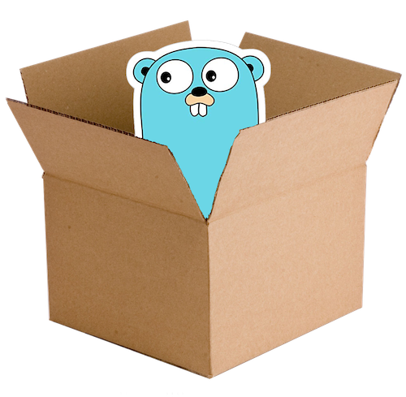

# Gopher in the box

As we know golang is a compiled language, so this benefits is a must know in terms of build a performant image size reducing the deploying time and the associted cost related to the CI/CD pipelines.

A must know technique in terms to have a optimal dockerfile is the multi-stage, without this tool we need to make the struggling to reduce the number of intermediate layers and files.

* Always compress the `RUN` commands together to avoid creating additional layer in the image.

After all this points we need to getting deep in the offered base images.

## Alpine

Alpine Linux is much smaller than most distribution base images (~5MB), and thus leads to much slimmer images in general.

## Distroless

This image made by Google team tend to be more slim than alpine, contains a minimal Linux image and can be used with mostly stacically typed languages link Go 😉

[documentation](https://github.com/GoogleContainerTools/distroless/blob/main/base/README.md)

## Scratch

Not much to say with name scratch, this image is the primordial to every one is a empty layer and we can run our Go app only if we statically build our app.

Keep in mind we don't have an OS running, so for example the ca-certificates and the tzdata is not available and is a must to the user to attach it to the image with another packages needed.